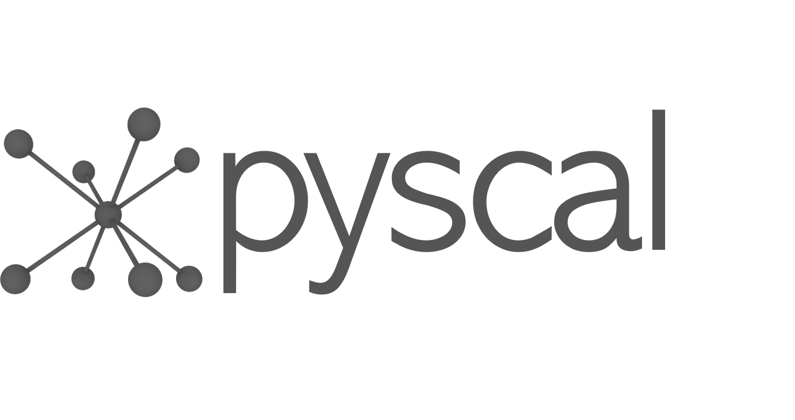

<table border="0">
 <tr>
    <td><b style="font-size:50px">pyscal</b></td>
    <td><b style="font-size:50px"></b></td>
 </tr>
 <tr>
    <td> 
 pyscal is a python module for the calculation of local atomic structural environments including Steinhardt's bond orientational order parameters during post-processing of atomistic simulation data. The core functionality of pyscal is written in C++ with python wrappers using pybind11 which allows for fast calculations with possibilities for easy expansion in python.
 </td>
    <td></td>
 </tr>
</table>

## **Examples**

1. [Getting started](examples/01_getting_started.ipynb) : Explore basic features of pyscal and how to get started with pyscal.
2. [Finding neighbors](examples/02_finding_neighbors.ipynb) : Various methods of finding the local neighborhood of an atom in pyscal, including cutoff and Voronoi methods.
3. [Bond orientational order parameters](examples/03_steinhardt_parameters.ipynb) : Calculation of bond orientational parameters, averaged and Voronoi weighted versions, and distinction of structures.
4. [Disorder parameters](examples/04_disorder_parameters.ipynb) : Disorder parameters based on Steinhardts parameters.
5. [Distinguishing solid and liquid atoms](examples/05_distinguishing_solid_liquid.ipynb) : Use Steinhardts parameters to distinguish between solid and liquid, and how to cluster solid atoms based on a property.
6. [Voronoi tessellation](examples/06_voronoi_tessellation.ipynb) : Identifying Voronoi polyhedra and calculation of associated volume.
7. [Angular parameters](examples/07_angular_parameters.ipynb) : Angular parameters for identification of tetrahedral ordering.
8. [$\chi$ parameters](examples/08_chi_params.ipynb) : Angular parameters for structural identification.
9. [Centrosymmetry parameter](examples/09_centrosymmetry_parameter.ipynb) : Parameters for identification of defects in crystals.
10. [Short range order](examples/10_short_range_order.ipynb) : Calculating ordering in binary systems.
11. [Entropy parameter](examples/11_entropy_parameter.ipynb) : Use a measure of entropy to distinguish solid and liquid.
12. [Calculation of energy](examples/12_calculating_energy.ipynb) : Use pyscal in combination with LAMMPS to calculate energy of atoms.
13. [Structural identification using entropy and enthalpy](examples/13_combining_energy_enthalpy.ipynb) : Combine entropy and energy methods to identify crystal structures.
14. [Working with lammps trajectories](examples/03_01_Steinhardts_parameters_for_lammps.ipynb) : Reading in a lammps trajectory, calculating Steinhardt's parameter for slices and various cluster properties.

