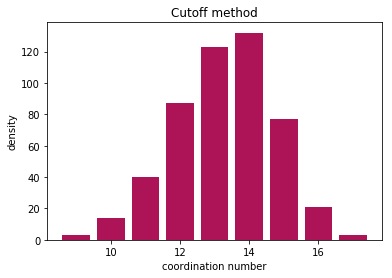

Calculating coordination numbers
--------------------------------

| In this example, we will read in a snapshot from an MD simulation and
  then calculate the coordination number distribution.
| This example assumes that you read the basic example.

.. code:: ipython2

    import pybop.core as pc
    import numpy as np
    import matplotlib.pyplot as plt

Read in a file
~~~~~~~~~~~~~~

.. code:: ipython2

    sys = pc.System()
    sys.read_inputfile('conf.dump')

Calculating neighbors
~~~~~~~~~~~~~~~~~~~~~

| We start by calculating the neighbors of each atom in the system.
  There are two ways to do this, using a cutoff method and using a
  voronoi polyhedra method.
| We will try with both of them. First we try with cutoff system.

Cutoff method
^^^^^^^^^^^^^

Cutoff method takes cutoff distance value and finds all atoms within the
cutoff distance of the host atom.

.. code:: ipython2

    sys.get_neighbors(method='cutoff', cutoff=3.6)

Now lets get all the atoms.

.. code:: ipython2

    atoms = sys.get_allatoms()

lets try accessing the coordination number of an atom

.. code:: ipython2

    atoms[0].get_coordination()

.. parsed-literal::

    15

We can loop over all atoms and create a histogram of the results

.. code:: ipython2

    coord = [atom.get_coordination() for atom in atoms]

Now lets plot and see the results

.. code:: ipython2

    nos, counts = np.unique(coord, return_counts=True)
    plt.bar(nos, counts, color="#AD1457")
    plt.ylabel("density")
    plt.xlabel("coordination number")
    plt.title("Cutoff method")

.. parsed-literal::

    Text(0.5,1,'Cutoff method')

Now finally we can compare with the voronoi method

Voronoi method
~~~~~~~~~~~~~~

| Voronoi method calculates the voronoi polyhedra of all atoms. Any atom
  that shares a voronoi face area with the host atom are considered
  neighbors.
| Voronoi polyhedra is calculated using the Voro++ code. However, you
  dont need to install this specifically as it is linked to pybop.

.. code:: ipython2

    sys.get_neighbors(method='voronoi')

Once again, lets get all atoms and find their coordination

.. code:: ipython2

    atoms = sys.get_allatoms()
    coord = [atom.get_coordination() for atom in atoms]

And visualise the results

.. code:: ipython2

    nos, counts = np.unique(coord, return_counts=True)
    plt.bar(nos, counts, color="#AD1457")
    plt.ylabel("density")
    plt.xlabel("coordination number")
    plt.title("Voronoi method")

.. parsed-literal::

    Text(0.5,1,'Voronoi method')

.. image:: output_25_1.png

Finally..
~~~~~~~~~

Both methods find the coordination number, and the results are
comparable. Cutoff method is very sensitive to the choice of cutoff
radius, but voronoi method can slightly overestimate the neighbors due
to thermal vibrations.
