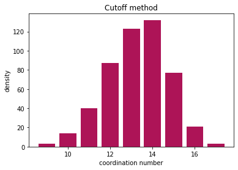
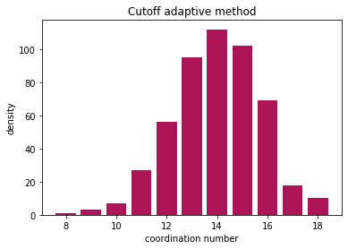

Calculating coordination numbers
--------------------------------

| In this example, we will read in a snapshot from an MD simulation and
  then calculate the coordination number distribution.
| This example assumes that you read the basic example.

.. code:: python

    import pyscal.core as pc
    import numpy as np
    import matplotlib.pyplot as plt

Read in a file
~~~~~~~~~~~~~~

The first step is setting up a system. We can create atoms and
simulation box using the ``pyscal.crystal_structures`` module. Let's
start by importing the module.

.. code:: python

    import pyscal.crystal_structures as pcs

.. code:: python

    atoms, box = pcs.make_crystal('bcc', lattice_constant= 4.00, repetitions=[6,6,6])

The above function creates an bcc crystal of 6x6x6 unit cells with a
lattice constant of 4.00 along with a simulation box that encloses the
particles. We can then create a ``System`` and assign the atoms and box
to it.

.. code:: python

    sys = pc.System()
    sys.assign_atoms(atoms, box)

Calculating neighbors
~~~~~~~~~~~~~~~~~~~~~

We start by calculating the neighbors of each atom in the system. There
are two ways to do this, either using a `cutoff <https://pyscal.readthedocs.io/en/latest/nearestneighbormethods.html#fixed-cutoff-method>`_ or using a
`voronoi <https://pyscal.readthedocs.io/en/latest/nearestneighbormethods.html#voronoi-tessellation>`_ polyhedra method. First the cutoff method is illustrated - which has two sub-options. 

Cutoff method
^^^^^^^^^^^^^

Cutoff method takes cutoff distance value and finds all atoms within the
cutoff distance of the host atom.

.. code:: python

    sys.find_neighbors(method='cutoff', cutoff=4.1)

Now lets get all the atoms.

.. code:: python

    atoms = sys.get_atoms()

    

lets try accessing the coordination number of an atom

.. code:: python

    atoms[0].get_coordination()

.. parsed-literal::

    14

As we would expect for a bcc type lattice, we see that the atom has 14
neighbors (8 in the first shell and 6 in the second). It is important to note that you could tune the cutoff radius to select only the first shell. Now a more interesting example where a distribution of coordination numbers exist is shown. A file with a bcc system with thermal vibrations is used as input.

.. code:: python

    sys = pc.System()
    sys.read_inputfile('conf.dump')
    sys.find_neighbors(method='cutoff', cutoff=3.6)
    atoms = sys.get_atoms()

We can loop over all atoms and create a histogram of the results

.. code:: python

    coord = [atom.get_coordination() for atom in atoms]

Now lets plot and see the results

.. code:: python

    nos, counts = np.unique(coord, return_counts=True)
    plt.bar(nos, counts, color="#AD1457")
    plt.ylabel("density")
    plt.xlabel("coordination number")
    plt.title("Cutoff method")

    

Adaptive cutoff methods
~~~~~~~~~~~~~~~~~~~~~~~

``pyscal`` also has `adaptive cutoff methods implemented <https://pyscal.readthedocs.io/en/latest/nearestneighbormethods.html#adaptive-cutoff-methods>`_. These methods
remove the restriction on having a global cutoff. Separate cutoffs are
selected for each atom during runtime. ``pyscal`` uses two distinct
algorithms to do this - `sann <https://pyscal.readthedocs.io/en/latest/nearestneighbormethods.html#solid-angle-based-nearest-neighbor-algorithm-sann>`_ and `adaptive <https://pyscal.readthedocs.io/en/latest/nearestneighbormethods.html#adaptive-cutoff-method>`_. Please check the
documentation for a explanation of these algorithms. For the purpose of
this example, we will use the adaptive algorithm.

adaptive algorithm

.. code:: python

    sys.find_neighbors(method='cutoff', cutoff='adaptive', padding=1.5)
    atoms = sys.get_atoms()
    coord = [atom.get_coordination() for atom in atoms]

Now lets plot

.. code:: python

    nos, counts = np.unique(coord, return_counts=True)
    plt.bar(nos, counts, color="#AD1457")
    plt.ylabel("density")
    plt.xlabel("coordination number")
    plt.title("Cutoff adaptive method")

    

The adaptive method also gives similar results!

Voronoi method
~~~~~~~~~~~~~~

`Voronoi method <https://pyscal.readthedocs.io/en/latest/nearestneighbormethods.html#voronoi-tessellation>`_ calculates the voronoi polyhedra of all atoms. Any atom
that shares a voronoi face area with the host atom are considered
neighbors. Voronoi polyhedra is calculated using the Voro++ code.
However, you dont need to install this specifically as it is linked to
pyscal.

.. code:: python

    sys.find_neighbors(method='voronoi')

Once again, lets get all atoms and find their coordination

.. code:: python

    atoms = sys.get_allatoms()
    coord = [atom.get_coordination() for atom in atoms]

And visualise the results

.. code:: python

    nos, counts = np.unique(coord, return_counts=True)
    plt.bar(nos, counts, color="#AD1457")
    plt.ylabel("density")
    plt.xlabel("coordination number")
    plt.title("Voronoi method")

    

Finally..
~~~~~~~~~

All methods find the coordination number, and the results are
comparable. The choice of a method depends on the problem at hand. Cutoff method is robust and fast, while Voronoi method gives a truly parameter free approach.