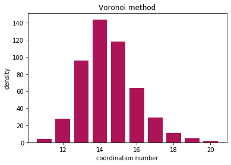

Calculating coordination numbers
--------------------------------

In this example, we will read in a configuration from an MD simulation
and then calculate the coordination number distribution.
This example assumes that you read the `basic
example <https://pyscal.readthedocs.io/en/latest/examples.html#basic-examples>`__.

.. code:: python

    import pyscal.core as pc
    import numpy as np
    import matplotlib.pyplot as plt

Read in a file
~~~~~~~~~~~~~~

The first step is setting up a system. We can create atoms and
simulation box using the :mod:`~pyscal.crystal_structures module`. Let us
start by importing the module.

.. code:: python

    import pyscal.crystal_structures as pcs

.. code:: python

    atoms, box = pcs.make_crystal('bcc', lattice_constant= 4.00, repetitions=[6,6,6])

The above function creates an bcc crystal of 6x6x6 unit cells with a
lattice constant of 4.00 along with a simulation box that encloses the
particles. We can then create a :class:`~pyscal.core.System` and assign the atoms and box
to it.

.. code:: python

    sys = pc.System()
    sys.atoms = atoms
    sys.box = box

Calculating neighbors
~~~~~~~~~~~~~~~~~~~~~

We start by calculating the neighbors of each atom in the system. There
are two ways to do this, using a ``cutoff`` method and using a
``voronoi`` polyhedra method. We will try with both of them. First we
try with cutoff system - which has three sub options. We will check each
of them in detail.

Cutoff method
^^^^^^^^^^^^^

Cutoff method takes cutoff distance value and finds all atoms within the
cutoff distance of the host atom.

.. code:: python

    sys.find_neighbors(method='cutoff', cutoff=4.1)

Now lets get all the atoms.

.. code:: python

    atoms = sys.atoms

let us try accessing the coordination number of an atom

.. code:: python

    atoms[0].coordination

.. parsed-literal::

    14

As we would expect for a bcc type lattice, we see that the atom has 14
neighbors (8 in the first shell and 6 in the second). Lets try a more
interesting example by reading in a bcc system with thermal vibrations.
Thermal vibrations lead to distortion in atomic positions, and hence
there will be a distribution of coordination numbers.

.. code:: python

    sys = pc.System()
    sys.read_inputfile('conf.dump')
    sys.find_neighbors(method='cutoff', cutoff=3.6)
    atoms = sys.atoms

We can loop over all atoms and create a histogram of the results

.. code:: python

    coord = [atom.coordination for atom in atoms]

Now lets plot and see the results

.. code:: python

    nos, counts = np.unique(coord, return_counts=True)
    plt.bar(nos, counts, color="#AD1457")
    plt.ylabel("density")
    plt.xlabel("coordination number")
    plt.title("Cutoff method")

.. image:: coord_1.png

Adaptive cutoff methods
~~~~~~~~~~~~~~~~~~~~~~~

pyscal also has adaptive cutoff methods implemented. These methods
remove the restriction on having a global cutoff. A distinct cutoff is
selected for each atom during runtime. pyscal uses two distinct
algorithms to do this - ``sann`` and ``adaptive``. Please check the
`documentation <https://pyscal.readthedocs.io/en/latest/nearestneighbormethods.html>`__
for a explanation of these algorithms. For the purpose of this example,
we will use the ``adaptive`` algorithm.

**adaptive algorithm**

.. code:: python

    sys.find_neighbors(method='cutoff', cutoff='adaptive', padding=1.5)
    atoms = sys.atoms
    coord = [atom.coordination for atom in atoms]

Now let us plot

.. code:: python

    nos, counts = np.unique(coord, return_counts=True)
    plt.bar(nos, counts, color="#AD1457")
    plt.ylabel("density")
    plt.xlabel("coordination number")
    plt.title("Cutoff adaptive method")

.. image:: coord_2.png

The adaptive method also gives similar results!

Voronoi method
~~~~~~~~~~~~~~

Voronoi method calculates the voronoi polyhedra of all atoms. Any atom
that shares a voronoi face area with the host atom are considered
neighbors. Voronoi polyhedra is calculated using the
`Voro++ <http://math.lbl.gov/voro++/>`__ code. However, you do not need to
install this specifically as it is linked to pyscal.

.. code:: python

    sys.find_neighbors(method='voronoi')

Once again, let us get all atoms and find their coordination

.. code:: python

    atoms = sys.atoms
    coord = [atom.coordination for atom in atoms]

And visualise the results

.. code:: python

    nos, counts = np.unique(coord, return_counts=True)
    plt.bar(nos, counts, color="#AD1457")
    plt.ylabel("density")
    plt.xlabel("coordination number")
    plt.title("Voronoi method")

Finally..
~~~~~~~~~

All methods find the coordination number, and the results are
comparable. Cutoff method is very sensitive to the choice of cutoff
radius, but Voronoi method can slightly overestimate the neighbors due
to thermal vibrations.
