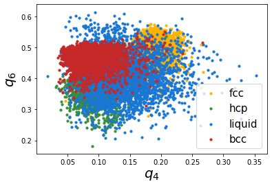
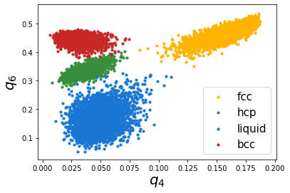
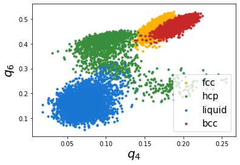

Calculating bond order parameters
---------------------------------

This example illustrates the calculation of bond order parameters. Bond
order parameters, represented by :math:`q_l` and their averaged
versions, :math:`\bar{q}_l` have been used for identifying atoms belong
to different crystal structures. In this example, we will consider one
MD snapshot each for bcc, fcc, hcp and liquid, and calculate the
:math:`q_4` and :math:`q_6` parameters and their averaged versions which
are widely used in literature.

.. code:: python

    import pyscal.core as pc
    import numpy as np
    import matplotlib.pyplot as plt

We will consider two sets of MD snapshots, first a set of perfect bcc,
fcc and hcp configurations and another set with thermal vibrations.

Perfect structures
~~~~~~~~~~~~~~~~~~

Read in the input files
^^^^^^^^^^^^^^^^^^^^^^^

First ``System`` objects are created for each of the different
configurations and the input files are read in.

.. code:: python

    bcc = pc.System()
    bcc.read_inputfile('conf0.bcc', format='lammps-dump')
    fcc = pc.System()
    fcc.read_inputfile('conf0.fcc', format='lammps-dump')
    hcp = pc.System()
    hcp.read_inputfile('conf0.hcp', format='lammps-dump')

The next major step is calculation of neighbors. There are two ways to
calculate neighbors, by using a cutoff distance or by using the voronoi
cells. We will try both approaches, but start with the cutoff method.

:math:`q_4-q_6` cutoff neighbor method
^^^^^^^^^^^^^^^^^^^^^^^^^^^^^^^^^^^^^^

.. code:: python

    bcc.get_neighbors(method='cutoff', cutoff=3.50)
    fcc.get_neighbors(method='cutoff', cutoff=3.50)
    hcp.get_neighbors(method='cutoff', cutoff=3.50)

We have used a cutoff of 3 here, but this is a parameter that has to be
tuned. Using a different cutoff for each structure is possible, but it
would complicate the method if the system has a mix of structures. Now
we can calculate the :math:`q_4` and :math:`q_6` distributions

.. code:: python

    bcc.calculate_q([4,6])
    fcc.calculate_q([4,6])
    hcp.calculate_q([4,6])

Thats it! Now lets gather the results and plot them.

.. code:: python

    bccq = bcc.get_qvals([4, 6])
    fccq = fcc.get_qvals([4, 6])
    hcpq = hcp.get_qvals([4, 6])

.. code:: python

    plt.scatter(bccq[0], bccq[1], s=60, label='bcc', color='#C62828')
    plt.scatter(fccq[0], fccq[1], s=60, label='fcc', color='#FFB300')
    plt.scatter(hcpq[0], hcpq[1], s=60, label='hcp', color='#388E3C')
    plt.xlabel("$q_4$", fontsize=20)
    plt.ylabel("$q_6$", fontsize=20)
    plt.legend(loc=4, fontsize=15)

.. parsed-literal::

    <matplotlib.legend.Legend at 0x7f68c6fa3b00>

.. image:: output_15_1.png

Firstly, we can see that all the atoms fall on one specific point which
is due to the absence of thermal vibrations. Next, all the points are
well separated and show good distinction. However, in most cases the
atomic positions are affected by thermal vibrations and hence show a
spread in the distribution. We will take a look at this in the next
case..

Structures with thermal vibrations
~~~~~~~~~~~~~~~~~~~~~~~~~~~~~~~~~~

Lets start with reading in the MD configurations

.. code:: python

    bcc = pc.System()
    bcc.read_inputfile('conf.bcc', format='lammps-dump')
    fcc = pc.System()
    fcc.read_inputfile('conf.fcc', format='lammps-dump')
    hcp = pc.System()
    hcp.read_inputfile('conf.hcp', format='lammps-dump')
    lqd = pc.System()
    lqd.read_inputfile('conf.lqd', format='lammps-dump')

Similar to the last example, we use the cutoff method

cutoff method
^^^^^^^^^^^^^

.. code:: python

    bcc.get_neighbors(method='cutoff', cutoff=3.50)
    fcc.get_neighbors(method='cutoff', cutoff=3.50)
    hcp.get_neighbors(method='cutoff', cutoff=3.50)
    lqd.get_neighbors(method='cutoff', cutoff=3.50)

And now, calculate q parameters

.. code:: python

    bcc.calculate_q([4,6])
    fcc.calculate_q([4,6])
    hcp.calculate_q([4,6])
    lqd.calculate_q([4,6])

Gather the q vales and plot them

.. code:: python

    bccq = bcc.get_qvals([4, 6])
    fccq = fcc.get_qvals([4, 6])
    hcpq = hcp.get_qvals([4, 6])
    lqdq = lqd.get_qvals([4, 6])

.. code:: python

    plt.scatter(fccq[0], fccq[1], s=10, label='fcc', color='#FFB300')
    plt.scatter(hcpq[0], hcpq[1], s=10, label='hcp', color='#388E3C')
    plt.scatter(lqdq[0], lqdq[1], s=10, label='liquid', color='#1976D2')
    plt.scatter(bccq[0], bccq[1], s=10, label='bcc', color='#C62828')
    plt.xlabel("$q_4$", fontsize=20)
    plt.ylabel("$q_6$", fontsize=20)
    plt.legend(loc=4, fontsize=15)

.. parsed-literal::

    <matplotlib.legend.Legend at 0x7f68c6f9aeb8>

This is not so great as the first case, we can see that the thermal
vibrations cause the distributions to spread a lot and overlap with each
other. Lechner and Dellago proposed using the averaged distributions,
:math:`\bar{q}_4-\bar{q}-6` to better distinguish the distributions.
Lets try that.

.. code:: python

    bcc.calculate_q([4,6], averaged=True)
    fcc.calculate_q([4,6], averaged=True)
    hcp.calculate_q([4,6], averaged=True)
    lqd.calculate_q([4,6], averaged=True)

.. code:: python

    bccaq = bcc.get_qvals([4, 6], averaged=True)
    fccaq = fcc.get_qvals([4, 6], averaged=True)
    hcpaq = hcp.get_qvals([4, 6], averaged=True)
    lqdaq = lqd.get_qvals([4, 6], averaged=True)

Lets see if these distributions are better..

.. code:: python

    plt.scatter(fccaq[0], fccaq[1], s=10, label='fcc', color='#FFB300')
    plt.scatter(hcpaq[0], hcpaq[1], s=10, label='hcp', color='#388E3C')
    plt.scatter(lqdaq[0], lqdaq[1], s=10, label='liquid', color='#1976D2')
    plt.scatter(bccaq[0], bccaq[1], s=10, label='bcc', color='#C62828')
    plt.xlabel("$q_4$", fontsize=20)
    plt.ylabel("$q_6$", fontsize=20)
    plt.legend(loc=4, fontsize=15)

.. parsed-literal::

    <matplotlib.legend.Legend at 0x7f68c6b4a048>

This looks much better! We can see that the resolution is much better
than the non averaged versions.

Voronoi method for neighbors
~~~~~~~~~~~~~~~~~~~~~~~~~~~~

Finally, we will try the Voronoi method to identify neighbors. This
method has the advantage that it is parameter-free. Lets see how it
does. We can use the existing systems we created, but recalculate the
neighbors.

.. code:: python

    bcc.get_neighbors(method='voronoi')
    fcc.get_neighbors(method='voronoi')
    hcp.get_neighbors(method='voronoi')
    lqd.get_neighbors(method='voronoi')

We calculate q params and plot the values

.. code:: python

    bcc.calculate_q([4,6], averaged=True)
    fcc.calculate_q([4,6], averaged=True)
    hcp.calculate_q([4,6], averaged=True)
    lqd.calculate_q([4,6], averaged=True)

.. code:: python

    bccaq = bcc.get_qvals([4, 6], averaged=True)
    fccaq = fcc.get_qvals([4, 6], averaged=True)
    hcpaq = hcp.get_qvals([4, 6], averaged=True)
    lqdaq = lqd.get_qvals([4, 6], averaged=True)

.. code:: python

    plt.scatter(fccaq[0], fccaq[1], s=10, label='fcc', color='#FFB300')
    plt.scatter(hcpaq[0], hcpaq[1], s=10, label='hcp', color='#388E3C')
    plt.scatter(lqdaq[0], lqdaq[1], s=10, label='liquid', color='#1976D2')
    plt.scatter(bccaq[0], bccaq[1], s=10, label='bcc', color='#C62828')
    plt.xlabel("$q_4$", fontsize=20)
    plt.ylabel("$q_6$", fontsize=20)
    plt.legend(loc=4, fontsize=15)

.. parsed-literal::

    <matplotlib.legend.Legend at 0x7f68f07d5390>

This method also distinguishes the structures well, except for some
overlap between fcc and bcc regions. However, there is the distinct
advantage that its parameter free.
