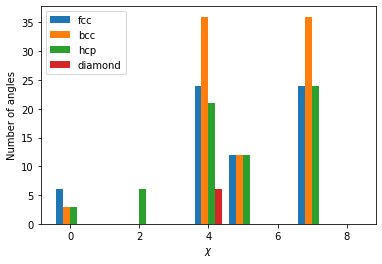

:math:`\chi` parameters
-----------------------

:math:`\chi` parameters introduced by `Ackland and
Jones <http://pyscal.com/en/latest/methods/angularmethods/chiparams.html>`__
measures the angles generated by pairs of neighbor atom around the host
atom, and assigns it to a histogram to calculate a local structure. In
this example, we will create different crystal structures and see how
the :math:`\chi` parameters change with respect to the local
coordination.

.. code:: python

    import pyscal.core as pc
    import pyscal.crystal_structures as pcs
    import matplotlib.pyplot as plt
    import numpy as np

The :mod:`~pyscal.crystal_structures` module is used to create
different perfect crystal structures. The created atoms and simulation
box is then assigned to a :class:`~pyscal.core.System` object. For
this example, fcc, bcc, hcp and diamond structures are created.

.. code:: python

    fcc_atoms, fcc_box = pcs.make_crystal('fcc', lattice_constant=4, repetitions=[4,4,4])
    fcc = pc.System()
    fcc.atoms = fcc_atoms
    fcc.box = fcc_box

.. code:: python

    bcc_atoms, bcc_box = pcs.make_crystal('bcc', lattice_constant=4, repetitions=[4,4,4])
    bcc = pc.System()
    bcc.atoms = bcc_atoms
    bcc.box = bcc_box

.. code:: python

    hcp_atoms, hcp_box = pcs.make_crystal('hcp', lattice_constant=4, repetitions=[4,4,4])
    hcp = pc.System()
    hcp.atoms = hcp_atoms
    hcp.box = hcp_box

.. code:: python

    dia_atoms, dia_box = pcs.make_crystal('diamond', lattice_constant=4, repetitions=[4,4,4])
    dia = pc.System()
    dia.atoms = dia_atoms
    dia.box = dia_box

Before calculating :math:`\chi` parameters, the `neighbors for each
atom <http://pyscal.com/en/latest/methods/nearestneighbormethods/nearestneighbormethods.html>`__
need to be found.

.. code:: python

    fcc.find_neighbors(method='cutoff', cutoff='adaptive')
    bcc.find_neighbors(method='cutoff', cutoff='adaptive')
    hcp.find_neighbors(method='cutoff', cutoff='adaptive')
    dia.find_neighbors(method='cutoff', cutoff='adaptive')

Now, :math:`\chi` parameters can be calculated

.. code:: python

    fcc.calculate_chiparams()
    bcc.calculate_chiparams()
    hcp.calculate_chiparams()
    dia.calculate_chiparams()

The calculated parameters for each atom can be accessed using the
:attr:`~pyscal.catom.Atom.chiparams` attribute.

.. code:: python

    fcc_atoms = fcc.atoms
    bcc_atoms = bcc.atoms
    hcp_atoms = hcp.atoms
    dia_atoms = dia.atoms

.. code:: python

    fcc_atoms[10].chiparams

.. parsed-literal::

    [6, 0, 0, 0, 24, 12, 0, 24, 0]

The output is an array of length 9 which shows the number of neighbor
angles found within specific bins as explained
`here <http://pyscal.com/en/latest/methods/angularmethods/chiparams.html>`__.
The output for one atom from each structure is shown below.

.. code:: python

    plt.bar(np.array(range(9))-0.3, fcc_atoms[10].chiparams, width=0.2, label="fcc")
    plt.bar(np.array(range(9))-0.1, bcc_atoms[10].chiparams, width=0.2, label="bcc")
    plt.bar(np.array(range(9))+0.1, hcp_atoms[10].chiparams, width=0.2, label="hcp")
    plt.bar(np.array(range(9))+0.3, dia_atoms[10].chiparams, width=0.2, label="diamond")
    plt.xlabel("$\chi$")
    plt.ylabel("Number of angles")
    plt.legend()

The atoms exhibit a distinct fingerprint for each structure. Structural
identification can be made up comparing the ratio of various
:math:`\chi` parameters as described in the `original
publication <https://journals.aps.org/prb/abstract/10.1103/PhysRevB.73.054104>`__.
