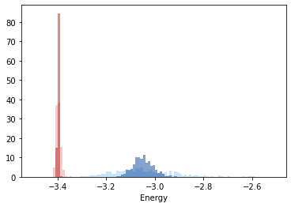

Calculating energy
------------------

pyscal can also be used for quick energy calculations. The energy per
atom can give an insight into the local environment. pyscal relies on
the `python library
interface <https://lammps.sandia.gov/doc/Python_library.html>`__ of
`LAMMPS <https://lammps.sandia.gov/>`__ for calculation of energy. The
python library interface, hence, is a requirement for energy
calculation. The easiest way to set up the LAMMPS library is by
installing LAMMPS through the conda package.

::

   conda install -c conda-forge lammps

Alternatively, `this
page <https://lammps.sandia.gov/doc/Python_head.html>`__ provides
information on how to compile manually.

Interatomic potentials
~~~~~~~~~~~~~~~~~~~~~~

An interatomic potential is also required for the calculation of energy.
The potential can be of `any type that LAMMPS
supports <https://lammps.sandia.gov/doc/pair_style.html>`__. For this
example, we will use an EAM potential for Mo which is provided in the
file ``Mo.set``.

We start by importing the necessary modules,

.. code:: python

    import pyscal.core as pc
    import matplotlib.pyplot as plt
    import numpy as np

For this example, a `LAMMPS dump
file <https://lammps.sandia.gov/doc/dump.html>`__ will be read in and
the energy will be calculated.

.. code:: python

    sys = pc.System()
    sys.read_inputfile("conf.bcc.dump")

Now the energy can be calculated by,

.. code:: python

    sys.calculate_energy(species=['Mo'], pair_style='eam/alloy', 
                         pair_coeff='* * Mo.set Mo', mass=95)

The first keyword above is ``species``, which specifies the atomic
species. This is required for `ASE <https://wiki.fysik.dtu.dk/ase/>`__
module which is used under the hood for convertion of files.
``pair_style`` species the type of potential used in LAMMPS. See
documentation `here <https://lammps.sandia.gov/doc/pair_style.html>`__.
``pair_coeff`` is another LAMMPS command which is documented well
`here <https://lammps.sandia.gov/doc/pair_coeff.html>`__. Also, the mass
needs to be provided.

Once the calculation is over, the energy can be accessed for each atom
as follows,

.. code:: python

    atoms = sys.atoms

.. code:: python

    atoms[0].energy

.. parsed-literal::

    -6.743130736133679

It is also possible to find the energy averaged over the neighbors using
the ``averaged`` keyword. However, a neighbor calculation should be done
before.

.. code:: python

    sys.find_neighbors(method="cutoff", cutoff=0)
    sys.calculate_energy(species=['Mo'], pair_style='eam/alloy', 
                         pair_coeff='* * Mo.set Mo', mass=95, averaged=True)

.. code:: python

    atoms = sys.atoms
    atoms[0].avg_energy

.. parsed-literal::

    -6.534395941639571

We have two test configurations for Al at 900 K, one is fcc structured
and the other one is in liquid state. We calculate the energy parameters
for each of these configurations.

.. code:: python

    sys = pc.System()
    sys.read_inputfile("../tests/conf.fcc.Al.dump")
    sys.find_neighbors(method="cutoff", cutoff=0)

.. code:: python

    sys.calculate_energy(species=['Al'], pair_style='eam/alloy', 
                         pair_coeff='* * Al.eam.fs Al', mass=26.98, averaged=True)

Now lets gather the energies

.. code:: python

    atoms = sys.atoms
    solid_energy = [atom.energy for atom in atoms]
    solid_avg_energy = [atom.avg_energy for atom in atoms]

We can repeat the calculations for the liquid phase,

.. code:: python

    sys = pc.System()
    sys.read_inputfile("../tests/conf.lqd.Al.dump")
    sys.find_neighbors(method="cutoff", cutoff=0)
    sys.calculate_energy(species=['Al'], pair_style='eam/alloy', 
                         pair_coeff='* * Al.eam.fs Al', mass=26.98, averaged=True)
    atoms = sys.atoms
    liquid_energy = [atom.energy for atom in atoms]
    liquid_avg_energy = [atom.avg_energy for atom in atoms]

Finally we can plot the results

.. code:: python

    xmin = -3.5
    xmax = -2.5
    bins = np.arange(xmin, xmax, 0.01)
    x = plt.hist(solid_energy, bins=bins, density=True, alpha=0.5, color="#EF9A9A")
    x = plt.hist(solid_avg_energy, bins=bins, density=True, alpha=0.5, color="#B71C1C")
    x = plt.hist(liquid_energy, bins=bins, density=True, alpha=0.5, color="#90CAF9")
    x = plt.hist(liquid_avg_energy, bins=bins, density=True, alpha=0.5, color="#0D47A1")
    plt.xlabel(r"Energy")

