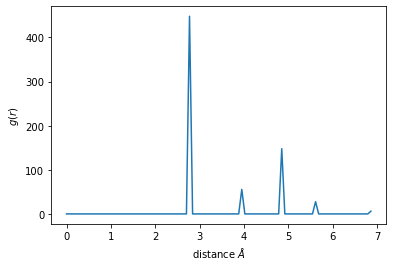

Cowley short range order parameter
----------------------------------

The `Cowley short range order
parameter <https://doi.org/10.1103/PhysRev.77.669>`__ can be used to
find if an alloy is ordered or not. The order parameter is given by,

.. math::

   \alpha_i = 1 - \frac{n_i}{m_A c_i}

where :math:`n_i` is the number of atoms of the non reference type among
the :math:`c_i` atoms in the :math:`i`\ th shell. :math:`m_A` is the
concentration of the non reference atom.

We can start by importing the necessary modules

.. code:: python

    import pyscal.core as pc
    import pyscal.crystal_structures as pcs
    import matplotlib.pyplot as plt

We need a binary alloy structure to calculate the order parameter. We
will use the crystal structures modules to do this. Here, we will create
a L12 structure.

.. code:: python

    atoms, box = pcs.make_crystal('l12', lattice_constant=4.00, repetitions=[2,2,2])

In order to use the order parameter, we need to have two shells of
neighbors around the atom. In order to get two shells of neighbors, we
will first estimate a cutoff using the radial distribution function.

.. code:: python

    val, dist = sys.calculate_rdf()

We can plot the rdf,

.. code:: python

    plt.plot(dist, val)
    plt.xlabel(r"distance $\AA$")
    plt.ylabel(r"$g(r)$")

In this case, a cutoff of about 4.5 will make sure that two shells are
included. Now the neighbors are calculated using this cutoff.

.. code:: python

    sys.find_neighbors(method='cutoff', cutoff=4.5)

Finally we can calculate the short range order. We will use the
reference type as 1 and also specify the average keyword as True. This
will allow us to get an average value for the whole simulation box.

.. code:: python

    sys.calculate_sro(reference_type=1, average=True)

.. parsed-literal::

    array([-0.33333333,  1.        ])

Value for individual atoms can be accessed by,

.. code:: python

    atoms = sys.atoms

.. code:: python

    atoms[4].sro

.. parsed-literal::

    [-0.33333333333333326, 1.0]

Only atoms of the non reference type will have this value!
