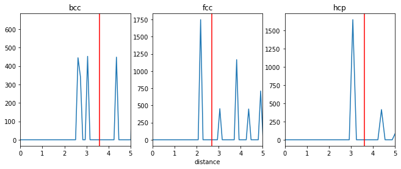
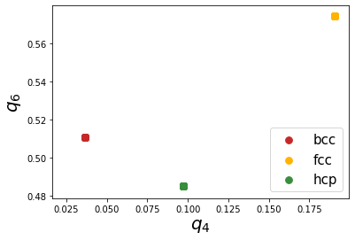
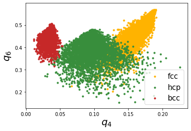
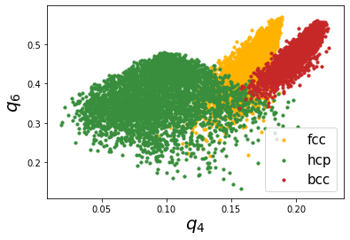

Calculating bond orientational order parameters
-----------------------------------------------

This example illustrates the calculation of bond orientational order
parameters. Bond order parameters, :math:`q_l` and their averaged
versions, :math:`\bar{q}_l` are widely used to identify atoms belong to
different crystal structures. In this example, we will consider MD
snapshots for bcc, fcc, hcp and liquid, and calculate the :math:`q_4`
and :math:`q_6` parameters and their averaged versions which are widely
used in literature. More details can be found
`here <https://pyscal.readthedocs.io/en/latest/steinhardtparameters.html>`__.

.. code:: python

    import pyscal.core as pc
    import pyscal.crystal_structures as pcs
    import numpy as np
    import matplotlib.pyplot as plt

In this example, we analyse MD configurations, first a set of perfect
bcc, fcc and hcp structures and another set with thermal vibrations.

Perfect structures
~~~~~~~~~~~~~~~~~~

To create atoms and box for perfect structures, the
:mod:`~pyscal.crystal_structures` module is used. The created atoms
and boxes are then assigned to ``System`` objects.

.. code:: python

    bcc_atoms, bcc_box = pcs.make_crystal('bcc', lattice_constant=3.147, repetitions=[4,4,4])
    bcc = pc.System()
    bcc.atoms = bcc_atoms
    bcc.box = bcc_box

.. code:: python

    fcc_atoms, fcc_box = pcs.make_crystal('fcc', lattice_constant=3.147, repetitions=[4,4,4])
    fcc = pc.System()
    fcc.atoms = fcc_atoms
    fcc.box = fcc_box

.. code:: python

    hcp_atoms, hcp_box = pcs.make_crystal('hcp', lattice_constant=3.147, repetitions=[4,4,4])
    hcp = pc.System()
    hcp.atoms = hcp_atoms
    hcp.box = hcp_box

Next step is calculation of nearest neighbors. There are two ways to
calculate neighbors, by using a cutoff distance or by using the voronoi
cells. In this example, we will use the cutoff method and provide a
cutoff distance for each structure.

Finding the cutoff distance
^^^^^^^^^^^^^^^^^^^^^^^^^^^

The cutoff distance is normally calculated in a such a way that the
atoms within the first shell is incorporated in this distance. The
:func:`~pyscal.core.System.calculate_rdf` function can be used to find
this cutoff distance.

.. code:: python

    bccrdf = bcc.calculate_rdf()
    fccrdf = fcc.calculate_rdf()
    hcprdf = hcp.calculate_rdf()

Now the calculated rdf is plotted

.. code:: python

    fig, (ax1, ax2, ax3) = plt.subplots(1, 3, figsize=(11,4))
    ax1.plot(bccrdf[1], bccrdf[0])
    ax2.plot(fccrdf[1], fccrdf[0])
    ax3.plot(hcprdf[1], hcprdf[0])
    ax1.set_xlim(0,5)
    ax2.set_xlim(0,5)
    ax3.set_xlim(0,5)
    ax1.set_title('bcc')
    ax2.set_title('fcc')
    ax3.set_title('hcp')
    ax2.set_xlabel("distance")
    ax1.axvline(3.6, color='red')
    ax2.axvline(2.7, color='red')
    ax3.axvline(3.6, color='red')

The selected cutoff distances are marked in red in the above plot. For
bcc, since the first two shells are close to each other, for this
example, we will take the cutoff in such a way that both shells are
included.

Steinhardt’s parameters - cutoff neighbor method
^^^^^^^^^^^^^^^^^^^^^^^^^^^^^^^^^^^^^^^^^^^^^^^^

.. code:: python

    bcc.find_neighbors(method='cutoff', cutoff=3.6)
    fcc.find_neighbors(method='cutoff', cutoff=2.7)
    hcp.find_neighbors(method='cutoff', cutoff=3.6)

We have used a cutoff of 3 here, but this is a parameter that has to be
tuned. Using a different cutoff for each structure is possible, but it
would complicate the method if the system has a mix of structures. Now
we can calculate the :math:`q_4` and :math:`q_6` distributions

.. code:: python

    bcc.calculate_q([4,6])
    fcc.calculate_q([4,6])
    hcp.calculate_q([4,6])

Thats it! Now lets gather the results and plot them.

.. code:: python

    bccq = bcc.get_qvals([4, 6])
    fccq = fcc.get_qvals([4, 6])
    hcpq = hcp.get_qvals([4, 6])

.. code:: python

    plt.scatter(bccq[0], bccq[1], s=60, label='bcc', color='#C62828')
    plt.scatter(fccq[0], fccq[1], s=60, label='fcc', color='#FFB300')
    plt.scatter(hcpq[0], hcpq[1], s=60, label='hcp', color='#388E3C')
    plt.xlabel("$q_4$", fontsize=20)
    plt.ylabel("$q_6$", fontsize=20)
    plt.legend(loc=4, fontsize=15)

Firstly, we can see that Steinhardt parameter values of all the atoms
fall on one specific point which is due to the absence of thermal
vibrations. Next, all the points are well separated and show good
distinction. However, at finite temperatures, the atomic positions are
affected by thermal vibrations and hence show a spread in the
distribution. We will show the effect of thermal vibrations in the next
example.

Structures with thermal vibrations
~~~~~~~~~~~~~~~~~~~~~~~~~~~~~~~~~~

Once again, we create the reqd structures using the
:mod:`~pyscal.crystal_structures` module. Noise can be applied to
atomic positions using the ``noise`` keyword as shown below.

.. code:: python

    bcc_atoms, bcc_box = pcs.make_crystal('bcc', lattice_constant=3.147, repetitions=[10,10,10], noise=0.01)
    bcc = pc.System()
    bcc.atoms = bcc_atoms
    bcc.box = bcc_box

.. code:: python

    fcc_atoms, fcc_box = pcs.make_crystal('fcc', lattice_constant=3.147, repetitions=[10,10,10], noise=0.01)
    fcc = pc.System()
    fcc.atoms = fcc_atoms
    fcc.box = fcc_box

.. code:: python

    hcp_atoms, hcp_box = pcs.make_crystal('hcp', lattice_constant=3.147, repetitions=[10,10,10], noise=0.01)
    hcp = pc.System()
    hcp.atoms = hcp_atoms
    hcp.box = hcp_box

cutoff method
^^^^^^^^^^^^^

.. code:: python

    bcc.find_neighbors(method='cutoff', cutoff=3.6)
    fcc.find_neighbors(method='cutoff', cutoff=2.7)
    hcp.find_neighbors(method='cutoff', cutoff=3.6)

And now, calculate :math:`q_4`, :math:`q_6` parameters

.. code:: python

    bcc.calculate_q([4,6])
    fcc.calculate_q([4,6])
    hcp.calculate_q([4,6])

Gather the q vales and plot them

.. code:: python

    bccq = bcc.get_qvals([4, 6])
    fccq = fcc.get_qvals([4, 6])
    hcpq = hcp.get_qvals([4, 6])

.. code:: python

    plt.scatter(fccq[0], fccq[1], s=10, label='fcc', color='#FFB300')
    plt.scatter(hcpq[0], hcpq[1], s=10, label='hcp', color='#388E3C')
    plt.scatter(bccq[0], bccq[1], s=10, label='bcc', color='#C62828')
    plt.xlabel("$q_4$", fontsize=20)
    plt.ylabel("$q_6$", fontsize=20)
    plt.legend(loc=4, fontsize=15)

.. image:: fig_3.png

This is not so great as the first case, we can see that the thermal
vibrations cause the distributions to spread a lot and overlap with each
other. Lechner and Dellago proposed using the averaged distributions,
:math:`\bar{q}_4-\bar{q}_6` to better distinguish the distributions.
Lets try that.

.. code:: python

    bcc.calculate_q([4,6], averaged=True)
    fcc.calculate_q([4,6], averaged=True)
    hcp.calculate_q([4,6], averaged=True)

.. code:: python

    bccaq = bcc.get_qvals([4, 6], averaged=True)
    fccaq = fcc.get_qvals([4, 6], averaged=True)
    hcpaq = hcp.get_qvals([4, 6], averaged=True)

Lets see if these distributions are better..

.. code:: python

    plt.scatter(fccaq[0], fccaq[1], s=10, label='fcc', color='#FFB300')
    plt.scatter(hcpaq[0], hcpaq[1], s=10, label='hcp', color='#388E3C')
    plt.scatter(bccaq[0], bccaq[1], s=10, label='bcc', color='#C62828')
    plt.xlabel("$q_4$", fontsize=20)
    plt.ylabel("$q_6$", fontsize=20)
    plt.legend(loc=4, fontsize=15)

This looks much better! We can see that the resolution is much better
than the non averaged versions.

There is also the possibility to calculate structures using Voronoi
based neighbor identification too. Let’s try that now.

.. code:: python

    bcc.find_neighbors(method='voronoi')
    fcc.find_neighbors(method='voronoi')
    hcp.find_neighbors(method='voronoi')

.. code:: python

    bcc.calculate_q([4,6], averaged=True)
    fcc.calculate_q([4,6], averaged=True)
    hcp.calculate_q([4,6], averaged=True)

.. code:: python

    bccaq = bcc.get_qvals([4, 6], averaged=True)
    fccaq = fcc.get_qvals([4, 6], averaged=True)
    hcpaq = hcp.get_qvals([4, 6], averaged=True)

Plot the calculated points..

.. code:: python

    plt.scatter(fccaq[0], fccaq[1], s=10, label='fcc', color='#FFB300')
    plt.scatter(hcpaq[0], hcpaq[1], s=10, label='hcp', color='#388E3C')
    plt.scatter(bccaq[0], bccaq[1], s=10, label='bcc', color='#C62828')
    plt.xlabel("$q_4$", fontsize=20)
    plt.ylabel("$q_6$", fontsize=20)
    plt.legend(loc=4, fontsize=15)

Voronoi based method also provides good resolution,the major difference
being that the location of bcc distribution is different.
