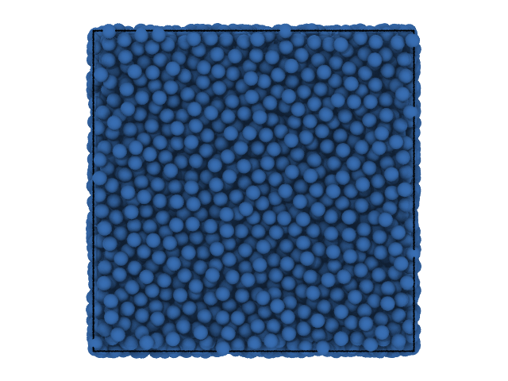
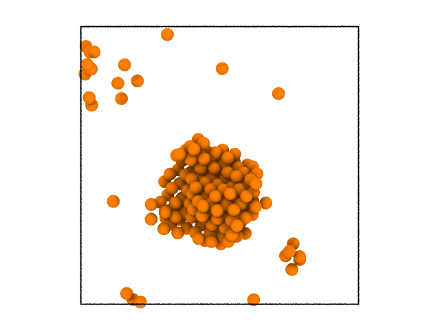
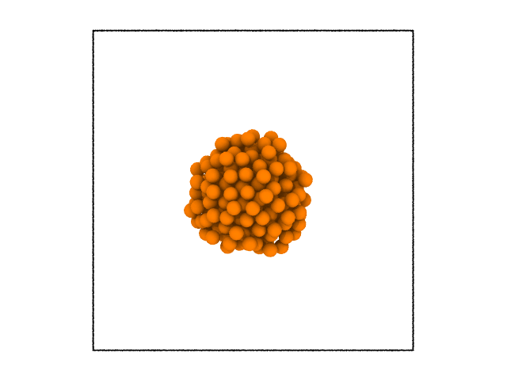

Distinction of solid liquid atoms and clustering
------------------------------------------------

In this example, we will take one configuration from a molecular dynamics
simulation which has a solid cluster in liquid. The task is to identify
solid atoms and cluster them. More details about the method can be found
`here <https://pyscal.readthedocs.io/en/latest/solidliquid.html>`_.

The first step is, of course, importing all the necessary module. For
visualisation, we will use `Ovito <https://www.ovito.org/>`__.

The above image shows a visualization of the system using Ovito.
Importing modules,

.. code:: python

    import pyscal.core as pc

Now we will set up a :class:`~pyscal.core.System` with this input file, and calculate
neighbors. Here we will use a cutoff method to find neighbors. More
details about finding neighbors can be found
`here <https://pyscal.readthedocs.io/en/latest/nearestneighbormethods.html#>`__.

.. code:: python

    sys = pc.System()
    sys.read_inputfile('cluster.dump')
    sys.find_neighbors(method='cutoff', cutoff=3.63)

Once we compute the neighbors, the next step is to find solid atoms.
This can be done using :func:`~pyscal.core.System.find_solids` method.

.. code:: python

    sys.find_solids(bonds=6, threshold=0.5, avgthreshold=0.6, cluster=False)

The above statement found all the solid atoms. Solid atoms can be
identified by the value of the :attr:`~pyscal.catom.Atom.solid` attribute. For that we first
get the atom objects and select those with :attr:`~pyscal.catom.Atom.solid` value as True.

.. code:: python

    atoms = sys.atoms
    solids = [atom for atom in atoms if atom.solid]
    len(solids)

.. parsed-literal::

    202

There are 202 solid atoms in the system. In order to visualise in Ovito,
we need to first write it out to a trajectory file. This can be done
with the help of :func:`~pyscal.core.System.to_file` method of System. This method can help to
save any attribute of the atom or any Steinhardt parameter value.

.. code:: python

    sys.to_file('sys.solid.dat', custom = ['solid'])

We can now visualize this file in Ovito. After opening the file in
Ovito, the modifier `compute
property <https://ovito.org/manual/particles.modifiers.compute_property.html>`__
can be selected. The ``Output property`` should be ``selection`` and in
the expression field, ``solid==0`` can be selected to select all the non
solid atoms. Applying a modifier `delete selected
particles <https://ovito.org/manual/particles.modifiers.delete_selected_particles.html>`__
can be applied to delete all the non solid particles. The system after
removing all the liquid atoms is shown below.

Clustering algorithm
~~~~~~~~~~~~~~~~~~~~

You can see that there is a cluster of atom. The clustering functions
that pyscal offers helps to select atoms that belong to this cluster. If you used :func:`~pyscal.core.System.find_clusters`
with ``cluster=True``, the clustering is carried out. Since we did used
``cluster=False`` above, we will rerun the function

.. code:: python

    sys.find_solids(bonds=6, threshold=0.5, avgthreshold=0.6, cluster=True)

.. parsed-literal::

    176

You can see that the above function call returned the number of atoms
belonging to the largest cluster as an output. In order to extract atoms
that belong to the largest cluster, we can use the :attr:`~pyscal.catom.Atom.largest_cluster`
attribute of the atom.

.. code:: python

    atoms = sys.atoms
    largest_cluster = [atom for atom in atoms if atom.largest_cluster]
    len(largest_cluster)

.. parsed-literal::

    176

The value matches that given by the function. Once again we will save
this information to a file and visualize it in Ovito.

.. code:: python

    sys.to_file('sys.cluster.dat', custom = ['solid', 'largest_cluster'])

The system visualized in Ovito following similar steps as above is shown
below.

.. figure:: system3.png
   :alt: system with only largest solid cluster

It is clear from the image that the largest cluster of solid atoms was
successfully identified. Clustering can be done over any property. The
following example with the same system will illustrate this.

Clustering based on a custom property
-------------------------------------

In pyscal, clustering can be done based on any property. The following
example illustrates this. To find the clusters based on a custom
property, the :func:`~pyscal.core.System.cluster_atoms` method has to be used. The
simulation box shown above has the centre roughly at (25, 25, 25). For
the custom clustering, we will cluster all atoms within a distance of 10
from the the rough centre of the box at (25, 25, 25). Let us define a
function that checks the above condition.

.. code:: python

    def check_distance(atom):
        #get position of atom
        pos = atom.pos
        #calculate distance from (25, 25, 25)
        dist = ((pos[0]-25)**2 + (pos[1]-25)**2 + (pos[2]-25)**2)**0.5
        #check if dist < 10
        return (dist <= 10)

The above function would return True or False depending on a condition
and takes the Atom as an argument. These are the two important
conditions to be satisfied. Now we can pass this function to cluster.
First, set up the system and find the neighbors.

.. code:: python

    sys = pc.System()
    sys.read_inputfile('cluster.dump')
    sys.find_neighbors(method='cutoff', cutoff=3.63)

Now cluster

.. code:: python

    sys.cluster_atoms(check_distance)

.. parsed-literal::

    242

There are 242 atoms in the cluster! Once again we can check this, save
to a file and visualize in ovito.

.. code:: python

    atoms = sys.atoms
    largest_cluster = [atom for atom in atoms if atom.largest_cluster]
    len(largest_cluster)

.. parsed-literal::

    242

.. code:: python

    sys.to_file('sys.dist.dat', custom = ['solid', 'largest_cluster'])

This example illustrates that any property can be used to cluster the
atoms!
