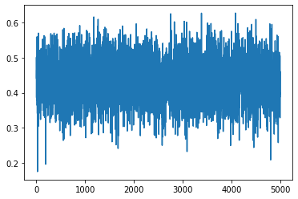
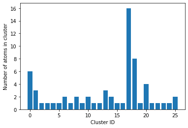
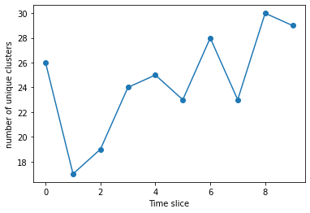

Analyzing a lammps trajectory
-----------------------------

In this example, a lammps trajectory in dump-text format will be read
in, and Steinhardt’s parameters will be calculated.

.. code:: python

    import pyscal.core as pc
    import os
    import pyscal.traj_process as ptp
    import matplotlib.pyplot as plt
    import numpy as np

First, we will use the ``split_trajectory`` method from
``pyscal.traj_process`` module to help split the trajectory into
individual snapshots.

.. code:: python

    trajfile = "traj.light"
    files = ptp.split_trajectory(trajfile)

``files`` contain the individual time slices from the trajectory.

.. code:: python

    len(files)

.. parsed-literal::

    10

.. code:: python

    files[0]

.. parsed-literal::

    'traj.light.snap.0.dat'

Now we can make a small function which reads a single configuration and
calculates :math:`q_6` values.

.. code:: python

    def calculate_q6(file, format="lammps-dump"):
        sys = pc.System()
        sys.read_inputfile(file, format=format)
        sys.find_neighbors(method="cutoff", cutoff=0)
        sys.calculate_q(6)
        q6 = sys.get_qvals(6)
        return q6

There are a couple of things of interest in the above function. The
``find_neighbors`` method finds the neighbors of the individual atoms.
Here, an adaptive method is used, but, one can also use a fixed cutoff
or Voronoi tessellation. Also only the unaveraged :math:`q_6` values are
calculated above. The averaged ones can be calculate using the
``averaged=True`` keyword in both ``calculate_q`` and ``get_qvals``
method. Now we can simply call the function for each file..

.. code:: python

    q6s = [calculate_q6(file) for file in files]

We can now visualise the calculated values

.. code:: python

    plt.plot(np.hstack(q6s))

Adding a clustering condition
~~~~~~~~~~~~~~~~~~~~~~~~~~~~~

We will now modify the above function to also find clusters which
satisfy particular :math:`q_6` value. But first, for a single file.

.. code:: python

    sys = pc.System()
    sys.read_inputfile(files[0])
    sys.find_neighbors(method="cutoff", cutoff=0)
    sys.calculate_q(6)

Now a clustering algorithm can be applied on top using the
``cluster_atoms`` method. ``cluster_atoms`` uses a
``condition as argument`` which should give a True/False value for each
atom. Lets define a condition.

.. code:: python

    def condition(atom):
        return atom.get_q(6) > 0.5

The above function returns ``True`` for any atom which has a :math:`q_6`
value greater than 0.5 and ``False`` otherwise. Now we can call the
``cluster_atoms`` method.

.. code:: python

    sys.cluster_atoms(condition)

.. parsed-literal::

    16

The method returns 16, which here is the size of the largest cluster of
atoms which have :math:`q_6` value of 0.5 or higher. If information
about all clusters are required, that can also be accessed.

.. code:: python

    atoms = sys.atoms

``atom.cluster`` gives the number of the cluster that each atom belongs
to. If the value is -1, the atom does not belong to any cluster, that
is, the clustering condition was not met.

.. code:: python

    clusters = [atom.cluster for atom in atoms if atom.cluster != -1]

Now we can see how many unique clusters are there, and what their sizes
are.

.. code:: python

    unique_clusters, counts = np.unique(clusters, return_counts=True)

``counts`` contain all the necessary information. ``len(counts)`` will
give the number of unique clusters.

.. code:: python

    plt.bar(range(len(counts)), counts)
    plt.ylabel("Number of atoms in cluster")
    plt.xlabel("Cluster ID")

Now we can finally put all of these together into a single function and
run it over our individual time slices.

.. code:: python

    def calculate_q6_cluster(file, cutoff_q6 = 0.5, format="lammps-dump"):
        sys = pc.System()
        sys.read_inputfile(file, format=format)
        sys.find_neighbors(method="cutoff", cutoff=0)
        sys.calculate_q(6)
        def _condition(atom):
            return atom.get_q(6) > cutoff_q6
        sys.cluster_atoms(condition)
        atoms = sys.atoms
        clusters = [atom.cluster for atom in atoms if atom.cluster != -1]
        unique_clusters, counts = np.unique(clusters, return_counts=True)
        return counts

.. code:: python

    q6clusters = [calculate_q6_cluster(file) for file in files]

We can plot the number of clusters for each slice

.. code:: python

    plt.plot(range(len(q6clusters)), [len(x) for x in q6clusters], 'o-')
    plt.xlabel("Time slice")
    plt.ylabel("number of unique clusters")

We can also plot the biggest cluster size

.. code:: python

    plt.plot(range(len(q6clusters)), [max(x) for x in q6clusters], 'o-')
    plt.xlabel("Time slice")
    plt.ylabel("Largest cluster size")

.. image:: fig_4.png

The final thing to do is to remove the split files after use.

.. code:: python

    for file in files:
        os.remove(file)

Using `ASE <https://wiki.fysik.dtu.dk/ase/>`__
~~~~~~~~~~~~~~~~~~~~~~~~~~~~~~~~~~~~~~~~~~~~~~

The above example can also done using ASE. The ASE read method needs to
be imported.

.. code:: python

    from ase.io import read

.. code:: python

    traj = read("traj.light", format="lammps-dump-text", index=":")

In the above function, ``index=":"`` tells ase to read the complete
trajectory. The individual slices can now be accessed by indexing.

.. code:: python

    traj[0]

.. parsed-literal::

    Atoms(symbols='H500', pbc=False, cell=[18.21922, 18.22509, 18.36899], momenta=...)

We can use the same functions as above, but by specifying a different
file format.

.. code:: python

    q6clusters_ase = [calculate_q6_cluster(x, format="ase") for x in traj]

We will plot and compare with the results from before,

.. code:: python

    plt.plot(range(len(q6clusters_ase)), [max(x) for x in q6clusters_ase], 'o-')
    plt.xlabel("Time slice")
    plt.ylabel("Largest cluster size")

.. image:: fig_5.png

As expected, the results are identical for both calculations!
