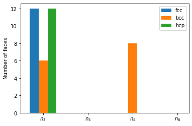

Voronoi parameters
------------------

`Voronoi
tessellation <http://pyscal.com/en/latest/methods/voronoiparameters/voronoiparameters.html>`__
can be used to identify local structure by counting the number of faces
of the Voronoi polyhedra of an atom. For each atom a vector
:math:`\langle n3~n4~n5~n6` can be calculated where :math:`n_3` is the
number of Voronoi faces of the associated Voronoi polyhedron with three
vertices, :math:`n_4` is with four vertices and so on. Each perfect
crystal structure such as a signature vector, for example, bcc can be
identified by :math:`\langle 0~6~0~8 \rangle` and fcc can be identified
using :math:`\langle 0~12~0~0 \rangle`. It is also a useful tool for
identifying icosahedral structure which has the fingerprint
:math:`\langle 0~0~12~0 \rangle`.

.. code:: python

    import pyscal.core as pc
    import pyscal.crystal_structures as pcs
    import matplotlib.pyplot as plt
    import numpy as np

The :mod:`~pyscal.crystal_structures` module is used to create
different perfect crystal structures. The created atoms and simulation
box is then assigned to a :class:`~pyscal.core.System` object. For
this example, fcc, bcc, hcp and diamond structures are created.

.. code:: python

    fcc_atoms, fcc_box = pcs.make_crystal('fcc', lattice_constant=4, repetitions=[4,4,4])
    fcc = pc.System()
    fcc.atoms = fcc_atoms
    fcc.box = fcc_box

.. code:: python

    bcc_atoms, bcc_box = pcs.make_crystal('bcc', lattice_constant=4, repetitions=[4,4,4])
    bcc = pc.System()
    bcc.atoms = bcc_atoms
    bcc.box = bcc_box

.. code:: python

    hcp_atoms, hcp_box = pcs.make_crystal('hcp', lattice_constant=4, repetitions=[4,4,4])
    hcp = pc.System()
    hcp.atoms = hcp_atoms
    hcp.box = hcp_box

Before calculating the Voronoi polyhedron, the `neighbors for each
atom <http://pyscal.com/en/latest/methods/nearestneighbormethods/nearestneighbormethods.html>`__
need to be found using Voronoi method.

.. code:: python

    fcc.find_neighbors(method='voronoi')
    bcc.find_neighbors(method='voronoi')
    hcp.find_neighbors(method='voronoi')

Now, Voronoi vector can be calculated

.. code:: python

    fcc.calculate_vorovector()
    bcc.calculate_vorovector()
    hcp.calculate_vorovector()

The calculated parameters for each atom can be accessed using the
:attr:`~pyscal.catom.Atom.vorovector` attribute.

.. code:: python

    fcc_atoms = fcc.atoms
    bcc_atoms = bcc.atoms
    hcp_atoms = hcp.atoms

.. code:: python

    fcc_atoms[10].vorovector

.. parsed-literal::

    [0, 12, 0, 0]

As expected, fcc structure exhibits 12 faces with four vertices each.
For a single atom, the difference in the Voronoi fingerprint is shown
below

.. code:: python

    fig, ax = plt.subplots()
    ax.bar(np.array(range(4))-0.2, fcc_atoms[10].vorovector, width=0.2, label="fcc")
    ax.bar(np.array(range(4)), bcc_atoms[10].vorovector, width=0.2, label="bcc")
    ax.bar(np.array(range(4))+0.2, hcp_atoms[10].vorovector, width=0.2, label="hcp")
    ax.set_xticks([1,2,3,4])
    ax.set_xlim(0.5, 4.25)
    ax.set_xticklabels(['$n_3$', '$n_4$', '$n_5$', '$n_6$'])
    ax.set_ylabel("Number of faces")
    ax.legend()

The difference in Voronoi fingerprint for bcc and the closed packed
structures is clearly visible. Voronoi tessellation, however, is
incapable of distinction between fcc and hcp structures.

Voronoi volume
--------------

Voronoi volume, which is the volume of the Voronoi polyhedron is
calculated when the neighbors are found. The volume can be accessed
using the :attr:`~pyscal.catom.Atom.volume` attribute.

.. code:: python

    fcc_atoms = fcc.atoms

.. code:: python

    fcc_vols = [atom.volume for atom in fcc_atoms]

.. code:: python

    np.mean(fcc_vols)

.. parsed-literal::

    16.0
