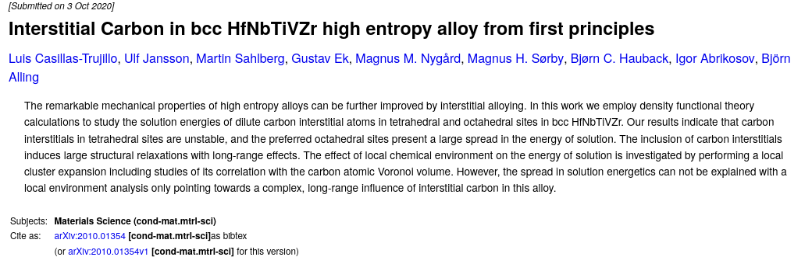
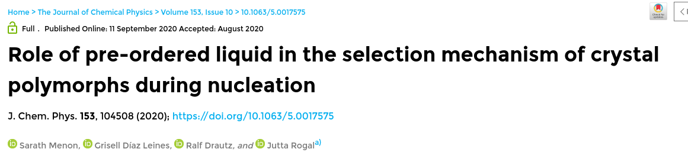
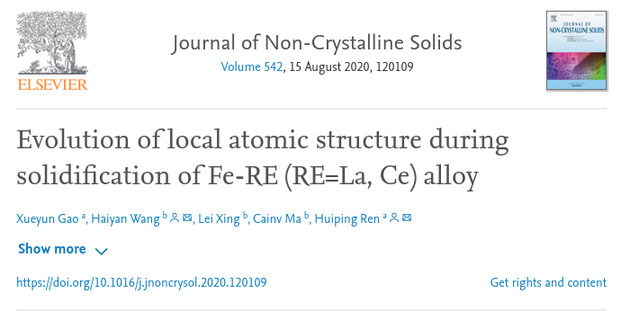
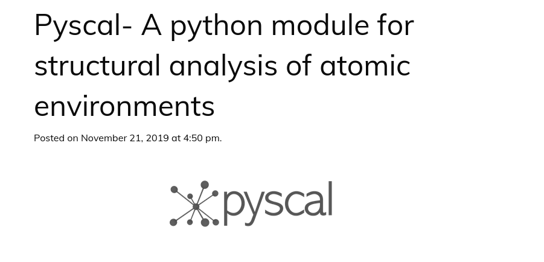
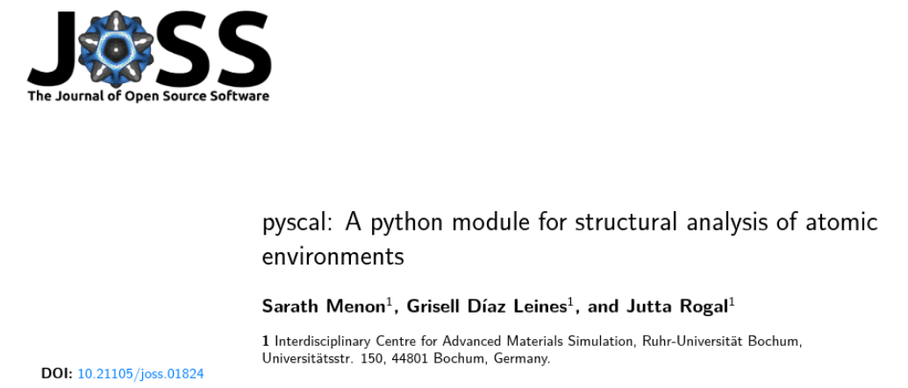
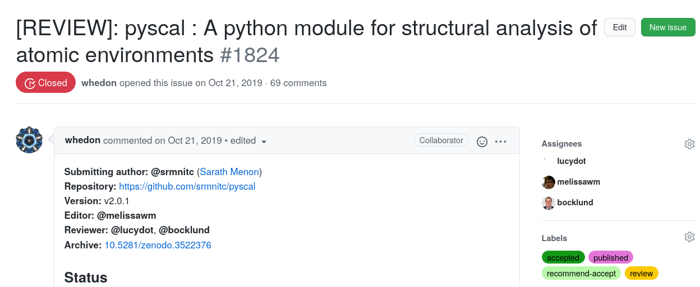

# News and updates

```{admonition} October 3, 2020



pyscal is cited in the preprint *Interstitial Carbon in bcc HfNbTiVZr high entropy alloy from first principles*. See the publication
[here](https://arxiv.org/abs/2010.01354).
```

```{admonition} September 11, 2020



pyscal is cited in the publication *Role of pre-ordered liquid in the selection mechanism of crystal polymorphs during nucleation*. See the publication
[here](https://aip.scitation.org/doi/full/10.1063/5.0017575).
```

```{admonition} August 15, 2020



pyscal is cited in the publication *Evolution of local atomic structure
during solidification of Fe-RE (RE=La, Ce) alloy*. See the publication
[here](https://www.sciencedirect.com/science/article/pii/S0022309320302222?via%3Dihub).
```

```{admonition} November 21, 2019



pyscal is selected as the E-CAM module of the month. See the news
[here](https://www.e-cam2020.eu/pyscal-a-python-module-for-structural-analysis-of-atomic-environments/).
```

```{admonition} November 1, 2019



pyscal paper is accepted in the Journal of Open Source Software. See the
paper [here](https://joss.theoj.org/papers/10.21105/joss.01824).
```

```{admonition} October 17, 2019



Publication for pyscal submitted to the Journal of Open Source Software.
See the review
[here](https://github.com/openjournals/joss-reviews/issues/1824).
```

```{admonition} July 12, 2019
[Version 1.0.0](https://github.com/srmnitc/pyscal/releases/tag/v1.0.0)
of pyscal is released.
```
